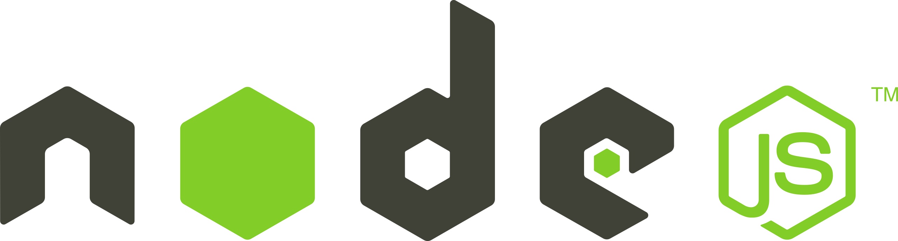
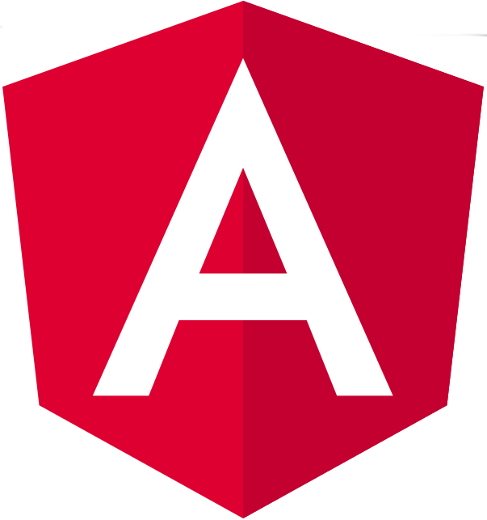
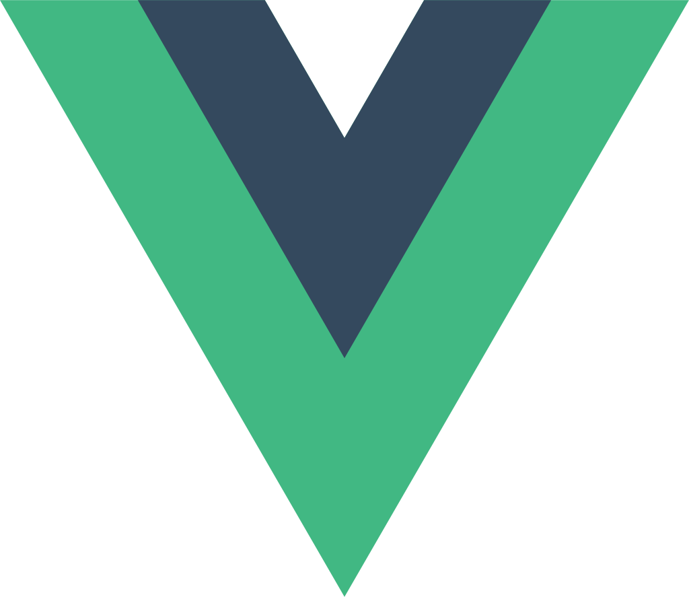
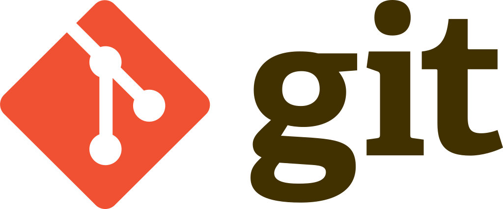
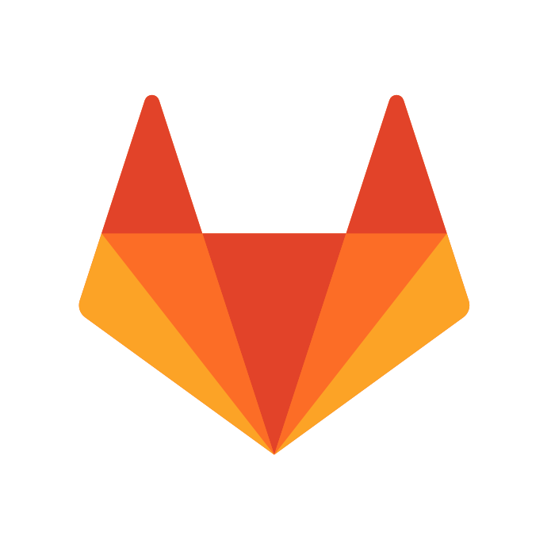

### Hello World, hi there, I'm Kamil 👋

## I'm an IT engineer and web developer 🧐
- **🧰 I'm currently working on [my personal website](https://github.com/KamilFilar/FilarDev)!** 
- **👨‍💻 Presently, I want to join the professional dev team.**
- **2022 Goals: Angular, Vue, React and improve my english skills! 🔥**
- **⚡ If you think you can't, you are right. If you think you can, you are also right!**

## 🛠 My technology stack:

    &nbsp;&nbsp;
    &nbsp;&nbsp;
    &nbsp;&nbsp;
    &nbsp;&nbsp;
    &nbsp;&nbsp;
    &nbsp;&nbsp;
    &nbsp;&nbsp;
    &nbsp;&nbsp;
    &nbsp;&nbsp;
    &nbsp;&nbsp;
    &nbsp;&nbsp;
    &nbsp;&nbsp;
    &nbsp;&nbsp;

